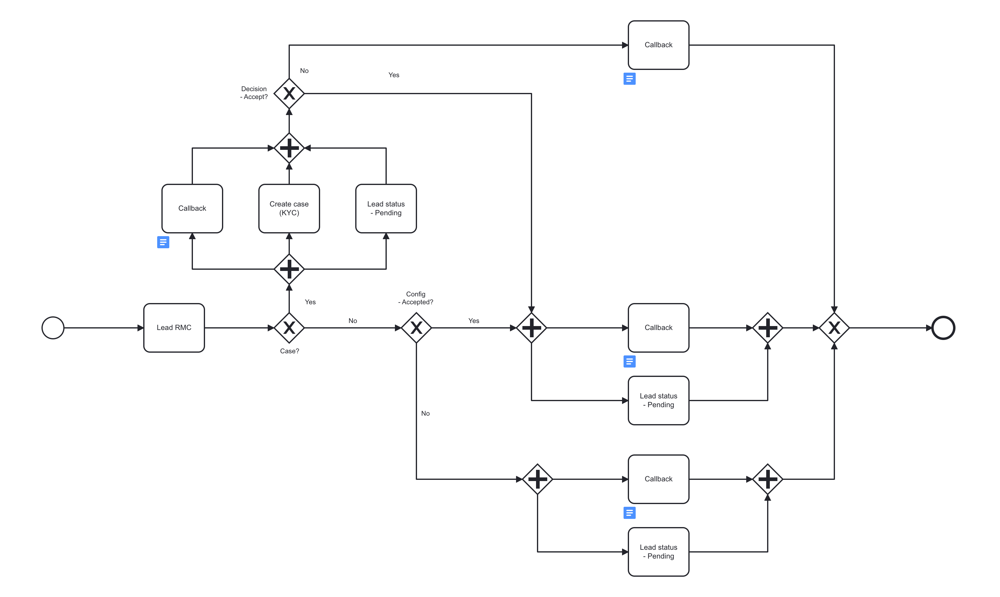

# Create a Lead
---

## EndPoint

**URL structure:** `http://[host][port][path][service]`

Customers contain identifying information and KYC data. This section provides information on how to generate a customer using the POST method. The documentation covers all aspects of API requests, including endpoints, responses, possible errors, and a minimalistic request example.

------------


## EndPoints

*swagger UI* `GET /swagger-ui/`

`POST /amlyze-ws-rest/customer (application/json)`

## Lead conditions
* Leads are NOT customers yet
* For a Lead, only <b>"SourceOfRiskLevel"</b> = `EVALUATE` is possible
* <b>"RiskManagementCategory"</b> is specified with a prefix or suffix LEAD_ (example - `LEAD_IND / LEAD_ORG`)
* The following fields must be completed in the same manner as for a [<b>Customer</b>](../customer/customer.md.md)
* Lead status will always stay `PENDING` regardless of the decision made
---

## Lead WorkFlow
* For a Lead to become a Customer → an <b>"Action"</b> = `UPDATE` must take place
* During `UPDATE` → <b>"RiskManagementCategory"</b> must be changed into Customer's one
* With the <b>"UPDATE"</b>, additional information should be provided including an important one → <b>"ApprovalDate"</b>
* After successful <b>"UPDATE"</b> → LEAD becomes a Customer and casual Customer Workflow takes place.
 ( More about the Customer → [<b>Here</b>](../customer/customer.md))

 ---
 

## Samples
[<b>LEAD_INDIVIDUAL Fields</b>](INDIVIDUAL/INDIVIDUAL_Fields.md)

* [Evaluate_LEAD_INDIVIDUAL_Mandatory](INDIVIDUAL/INDIVIDUAL_Samples/evaluate_LEAD_INDIVIDUAL_Mandatory.xml) 

[<b>LEAD_ORGANIZATION Fields</b>](ORGANIZATION\ORGANIZATION_Fields.md) 
* [Evaluate_LEAD_ORGANIZATION_Mandatory](ORGANIZATION/ORGANIZATION_Samples/evaluate_LEAD_ORGANIZATION_Mandatory.xml) 

---

----------------------

## Responses

<table>
		<thead>
			<tr>
				<td><b>Code</b></td>
				<td><b>Status</b></td>
				<td><b>Response</b></td>
			</tr>
		</thead>
		<tbody>
			<tr>
				<td><b>200</b></td>
				<td><i>OK</i></td>
				<td>
					<pre>
{
  "resultType": "REQUEST_ACCEPTED"
}
                    </pre>
				</td>
			</tr>
			<tr>
				<td><b>400</b></td>
				<td><i>Bad Request</i></td>
				<td> 
                    <pre>
{
 "errors": ["CommunicationNumber is mandatory"]
}
                    </pre>
				</td>
			</tr>
				<tr>
				<td><b>404</b></td>
				<td><i>Not Found</i></td>
				<td> 
                    <pre>
{
  "resultType": "REQUEST_REJECTED",
  "status": 404,
  "error": "Not Found"
}
                    </pre>
				</td>
			</tr>
			<tr>
				<td><b>500</b></td>
				<td><i>Internal Server Error</i></td>
				<td> 
                    <pre>
{
  "resultType": "REQUEST_REJECTED"
  "status": 500,
  "error": "Internal Server Error"
}
                    </pre>
				</td>
			</tr>
		</tbody>
</table>


**Possible errors**

All possible errors can be found [*here*](cust_possible_errors.md)  


------


## Minimalistic request

The Minimalistic request example below shows the minimum required fields to successfully create a lead. Other fields may be optionally included, as specified in the API documentation.


```json
{
	"communicationNumber": "ComNr_45",
	"customerExtId": "Lead_ExtaIdaa",
	"requester": "financial_institution",
	"action": "CREATE",
	"customerStatus": "ACTIVE",
	"riskManagementCategory": "LEAD_IND",
	"sourceOfRiskLevel": "EVALUATE",
	"riskLevel": "NONE",
	"entityType": "INDIVIDUAL",
	"applicationDate": "22023-01-20",
	"firstName": "Larosa",
	"lastName": "Rosa",
	"birthDate": "2000-05-10",
	"citizenshipCountry": "JP"
}
```
