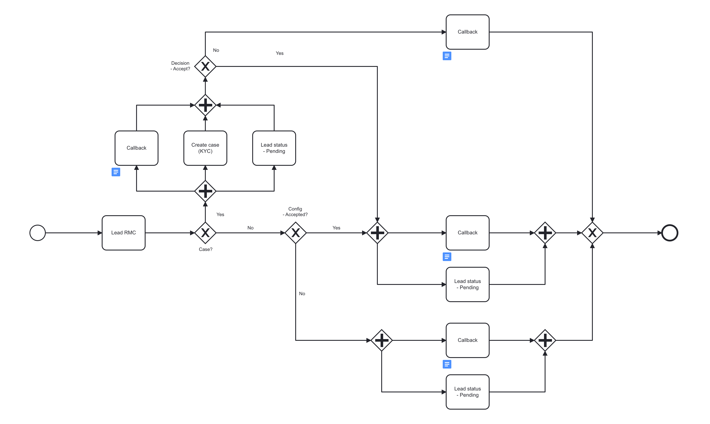

# Create a Lead
---

## EndPoint

**swagger** `GET /swagger-ui/`

**URL structure:** `http://[host][port][path][service]`

**Example:** `http://[host]:8878/amlyze-ws/EvaluateCustomerV2Service`

---

## Additional Info

* METHOD ` POST ` 
* Auth required: `NO`
* Content-Type: `text/xml`
---

## Lead conditions
* Leads are NOT customers yet
* For a Lead, only <b>"SourceOfRiskLevel"</b> = `EVALUATE` is possible
* <b>"RiskManagementCategory"</b> is specified with a prefix or suffix LEAD_ (example - `LEAD_IND / LEAD_ORG`)
* The following fields must be completed in the same manner as for a [<b>Customer</b>](../customer/customer.md.md)
* Lead status will always stay `PENDING` regardless of the decision made
---

## Lead WorkFlow
* For a Lead to become a Customer → an <b>"Action"</b> = `UPDATE` must take place
* During `UPDATE` → <b>"RiskManagementCategory"</b> must be changed into Customer's one
* With the <b>"UPDATE"</b>, additional information should be provided including an important one → <b>"ApprovalDate"</b>
* After successful <b>"UPDATE"</b> → LEAD becomes a Customer and casual Customer Workflow takes place.
 ( More about the Customer → [<b>Here</b>](../customer/customer.md))

 ---
 

## Samples
[<b>LEAD_INDIVIDUAL Fields</b>](INDIVIDUAL/INDIVIDUAL_Fields.md)

* [Evaluate_LEAD_INDIVIDUAL_Mandatory](INDIVIDUAL/INDIVIDUAL_Samples/evaluate_LEAD_INDIVIDUAL_Mandatory.xml) 

[<b>LEAD_ORGANIZATION Fields</b>](ORGANIZATION\ORGANIZATION_Fields.md) 
* [Evaluate_LEAD_ORGANIZATION_Mandatory](ORGANIZATION/ORGANIZATION_Samples/evaluate_LEAD_ORGANIZATION_Mandatory.xml) 

---

## Expected Response from your system

**<span style="color: green;">"Accepted request"</span>**

`If request was sent correctly, the <Result> displays  <ResultType> together with <CommunicationStatus>`

<table>
		<thead>
			<tr>
				<td ><b>XML TAG<b></td>
				<td ><b>TYPE<b></td>
				<td ><b>DESCRIPTION<b></td>
			</tr>
		</thead>
		<tbody>
			<tr>
				<td><b>ResultType<b></td>
				<td style="text-align:center"><i> String</br>Enum:</br>
[REQUEST_ACCEPTED]<i></td>
				<td>Result type returns the answer that the action was successful</td>
			</tr>
			<tr>
				<td><b>CommunicationStatus<b></td>
				<td style="text-align:center"><i>String</br>Enum:</br>
[COMPLETED]<i></td>
				<td>Indicates that Communication was successful</td>
		</tbody>
</table>

**Example:**

`STATUS: 200 OK`
```xml
<ns2:Result xmlns:ns2="urn:amlyze-services:EvaluateOperationService_v2r0">
            <ns2:ResultType>REQUEST_ACCEPTED</ns2:ResultType>
            <ns2:CommunicationStatus>COMPLETED</ns2:CommunicationStatus>
        </ns2:Result>
```
---
**<span style="color: red;">"Rejected request"</span>**

`If the request was sent not properly, the <Result> displays more information.`

<table>
		<thead>
			<tr>
				<td ><b>XML TAG<b></td>
				<td ><b>TYPE<b></td>
				<td ><b>DESCRIPTION<b></td>
			</tr>
		</thead>
		<tbody>
			<tr>
				<td><b>ResultType<b></td>
				<td style="text-align:center"> String</br>Enum:</br>
[REQUEST_REJECTED]</td>
				<td>Result type returns the answer that the action was not successful</td>
			</tr>
			<tr>
				<td><b>CommunicationStatus<b></td>
				<td style="text-align:center">String</br>Enum:</br>
[INVALID]</td>
				<td>"INVALID" Communication status can be received when some errors or mistakes occur</td>
            </tr>
            <tr>
				<td><b>ErrorCode<b></td>
				<td style="text-align:center">String</td>
				<td>Error code returns the code of an error</td>
            </tr>
            <tr>
				<td><b>ErrorDescription<b></td>
				<td style="text-align:center">String</td>
				<td>Error is described in a more detailed manner in error description field</td>
            </tr>
		</tbody>
</table>

**Example:**

`STATUS: 400 Bad Request / 500 Internal Server Error`
```xml
<ns2:Result xmlns:ns2="urn:amlyze-services:EvaluateOperationService_v2r0">
            <ns2:ResultType>REQUEST_REJECTED</ns2:ResultType>
            <ns2:CommunicationStatus>INVALID</ns2:CommunicationStatus>
            <ns2:ErrorCode>O001</ns2:ErrorCode>
            <ns2:ErrorDescription>Bad Request</ns2:ErrorDescription>
        </ns2:Result>
```

------


## Minimalistic request

The Minimalistic request example below shows the minimum required fields to successfully create a lead. Other fields may be optionally included, as specified in the API documentation.


```xml
<?xml version="1.0" encoding="utf-8"?>
<soap:Envelope xmlns:soap="http://schemas.xmlsoap.org/soap/envelope/">
    <soap:Body>
        <AMLYZE_CUSTOMER xmlns="urn:amlyze-services:EvaluateCustomerService_v2r0">
            <CommunicationNumber>ComNr_45</CommunicationNumber>
            <Requester>Bank_system</Requester>
            <RiskManagementCategory>LEAD_IND</RiskManagementCategory>
            <SourceOfRiskLevel>EVALUATE</SourceOfRiskLevel>
            <CustomerExtId>Lead_ExtaIdaa</CustomerExtId>
            <EntityType>INDIVIDUAL</EntityType>
            <ApplicationDate>2023-01-20</ApplicationDate>
            <FirstName>Larosa</FirstName>
            <LastName>Rosa</LastName>
            <BirthDate>1975-09-20</BirthDate>
            <CitizenshipCountry>JP</CitizenshipCountry>
            </AMLYZE_CUSTOMER>
    </soap:Body>
</soap:Envelope>
```


