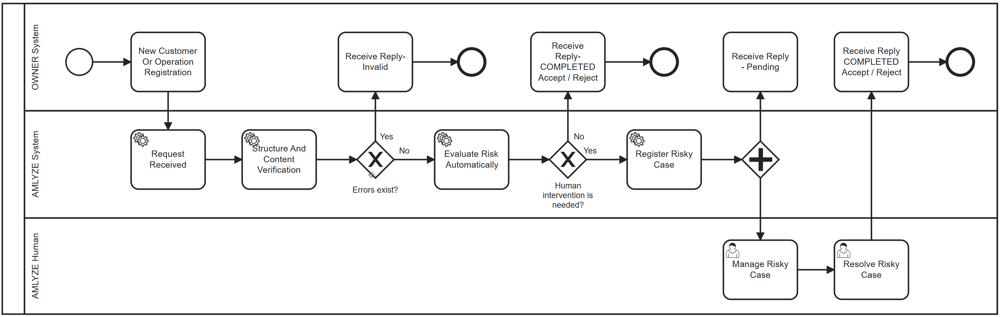

# Webhooks

> We use standart [Cloud Events](https://cloudevents.io/) (v1.0) to deliver information asynchronously via [HTTP Protocol Binding](https://github.com/cloudevents/spec/blob/v1.0.2/cloudevents/bindings/http-protocol-binding.md) about request made to the AMLYZE API

* You can find more information about the specs we are using in their [GitHub repository](https://github.com/cloudevents/spec).
* Also it is possible to use one of the [official SDK's](https://github.com/cloudevents/spec/blob/v1.0.2/cloudevents/SDK.md) to speedup integration with our system.

> Check related pages for events envelopes and events payloads details.

* [Customer update webhooks (callbacks)](Customer_update_webhooks.md)
* [Risk management webhooks (callbacks)](Risk_management_webhooks.md)
* [Screening webhooks (callbacks)](ScreeningWebhooks.md)

